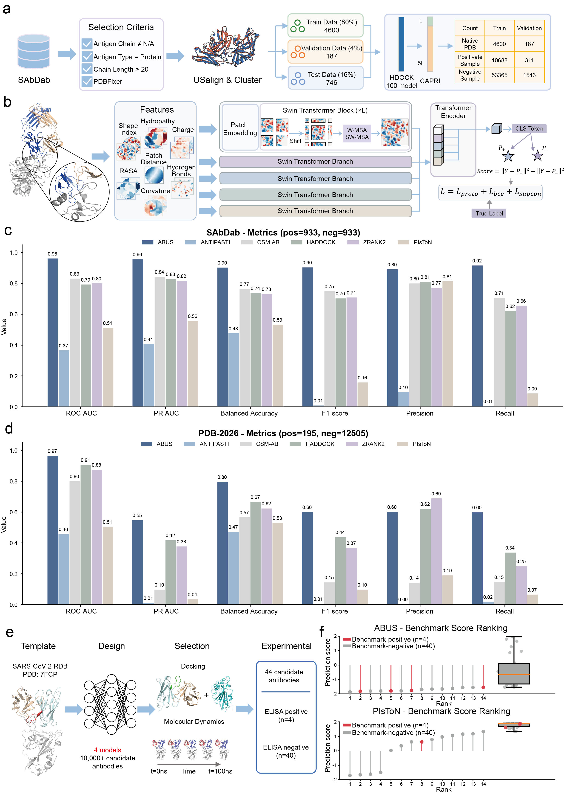

# ABUS: an antibody binding unified scoring framework for screening AI-designed antibodies

ABUS is a deep learning framework specifically designed for antigen–antibody interface scoring and large-scale screening of AI-designed antibodies. Built upon a multi-branch Swin Transformer architecture, ABUS integrates geometric and physicochemical interface features to model fine-grained local interaction patterns within antigen–antibody binding interfaces.

The framework enables efficient ranking and screening of docking conformations and AI-generated antibody candidates, achieving state-of-the-art performance on multiple benchmark datasets and experimentally validated antibody screening tasks. ABUS is designed to support practical large-scale antibody discovery workflows, where thousands to millions of candidate structures may need to be rapidly evaluated. In addition to prediction, the framework also provides a complete preprocessing pipeline for converting raw antigen–antibody complex structures into model-ready multi-channel interface representations. The repository includes preprocessing scripts, inference scripts, model training utilities, and example datasets.



---

# Table of Contents

* [Installation](#installation)

  * [Clone Repository](#clone-repository)
  * [Environment Setup](#environment-setup)
  * [Dependency Configuration](#dependency-configuration)
* [Usage](#usage)

  * [Data Preprocessing](#data-preprocessing)
  * [Prediction](#prediction)
  * [Model Training](#model-training)
  * [Testing](#testing)
* [Dataset Structure](#dataset-structure)
* [Citation](#citation)
* [Reference](#reference)

---

# Installation

We recommend using `conda` to manage the runtime environment. All codes were tested on Ubuntu 22.04, Python 3.7.16 and PyTorch 1.12.1+cu113. The preprocessing pipeline of ABUS depends on several external tools, including `MaSIF` (1), `MSMS`, `APBS`, `PDB2PQR`, `Reduce`, and `HDOCK`; (2) for protein surface construction, physicochemical feature extraction, protonation, and docking generation. Please ensure that all dependencies are correctly installed before running preprocessing or training scripts. The installation procedure mainly consists of the following steps:

1. Clone the ABUS repository and configure the Python environment.
2. Install external preprocessing dependencies.
3. Configure software paths and environment variables.  

## Clone Repository

```bash
git clone https://github.com/RPDGroup/ABUS.git
cd ABUS

bash setup.sh
```

The `setup.sh` script provides automated installation commands for the Python environment and several required dependencies. Depending on the local system environment and CUDA version, users may need to manually modify the PyTorch installation command in `setup.sh`.

## Environment Setup

### MaSIF

```bash
git clone https://github.com/LPDI-EPFL/masif.git
```

`MaSIF` is used for protein surface processing and interface feature extraction.

### Reduce

```bash
git clone https://github.com/rlabduke/reduce.git
export PATH="/path/to/reduce:$PATH"
```

`Reduce` is used for adding hydrogen atoms to protein structures before electrostatic feature calculation. Ensure that the executable can be directly called from the terminal.

### HDOCK

```bash
git clone https://github.com/huang-laboratory/HDOCKlite.git
export PATH="/path/to/HDOCKlite:$PATH"
```

`HDOCK` is required for generating docking conformations and constructing positive/negative docking samples.

### PDB2PQR

```bash
wget https://github.com/Electrostatics/pdb2pqr/releases/download/v2.1.1/pdb2pqr-linux-bin64-2.1.1.tar.gz
tar -zxvf pdb2pqr-linux-bin64-2.1.1.tar.gz
```

`PDB2PQR` is used to prepare structures for electrostatic calculations.

### APBS

```bash
wget https://github.com/Electrostatics/apbs/releases/download/v3.4.1/APBS-3.4.1.Linux.zip
unzip APBS-3.4.1.Linux.zip
```

`APBS` is used for electrostatic potential calculations during interface feature generation. Please ensure that both `apbs` and `multivalue` executables are correctly installed.

## Dependency Configuration

Before running preprocessing or training scripts, you need to manually configure the paths of external dependencies in:

```bash
utils/utils.py
```

Please modify the following variables in function `set_environment()` according to your local installation paths:

```python
MSMS_BIN
PDB2PQR_BIN
APBS_BIN
MULTIVALUE_BIN
REDUCE_BIN
```

Example:

```python
'MSMS_BIN': '/opt/conda/envs/abus_env/bin/msms'
'PDB2PQR_BIN': '/path/to/ABUS/pdb2pqr-linux-bin64-2.1.1/pdb2pqr'
'APBS_BIN': '/path/to/ABUS/APBS-3.4.1.Linux/bin/apbs'
'MULTIVALUE_BIN': '/path/to/ABUS/APBS-3.4.1.Linux/share/apbs/tools/bin/multivalue'
'REDUCE_BIN': '/path/to/ABUS/reduce-master/reduce'
```

---

# Usage

The ABUS framework supports:

* Antigen–antibody interface preprocessing
* Docking structure preparation
* Binding score prediction
* Model training

You can obtain command-line help using:

```bash
python ABUS.py --help
```

## Data Preprocessing

### Prepare a single antigen–antibody complex

```bash
python ABUS.py prepare --ppi 1A2Y_BA_C
```

### Prepare docking conformations

```bash
python ABUS.py prepare --ppi 1A2Y_BA_C --prepare_docking
```

The preprocessing pipeline automatically performs structure downloading, interface extraction, surface construction, geometric feature computation, and physicochemical feature projection. Generated feature maps are stored as `.npy` files and can be directly used for model training or inference.

### Command-line arguments

```bash
usage: ABUS v.1.0.0 prepare [-h] [--list LIST] [--ppi PPI] [--no_download]
                            [--download_only] [--prepare_docking]

optional arguments:
  -h, --help         show this help message and exit
  --list LIST        List with PPIs in format PID_A_B
  --ppi PPI          PPI in format PID_A_B (mutually exclusive with the --list
                     option)
  --no_download      If set True, the pipeline will skip the download part.
  --download_only    If set True, the program will only download PDB
                     structures without processing them.
  --prepare_docking  If set True, re-dock ground truth structures and pre-
                     process top 100 generated models
```

## Prediction

### Predict a single complex

```bash
python ABUS.py infer --pdb_dir /path/to/examples --out_dir /path/to/output --ppi 1A2Y_BA_C
```

### Predict multiple complexes

```bash
python ABUS.py infer --pdb_dir /path/to/examples --out_dir /path/to/output --list examples.txt
```

The inference module loads preprocessed interface feature maps and outputs binding scores for antigen–antibody complexes. Results are saved into the specified output directory for downstream analysis.

### Command-line arguments

```bash
usage: ABUS v.1.0.0 infer [-h] --pdb_dir PDB_DIR [--list LIST] [--ppi PPI]
                          --out_dir OUT_DIR

optional arguments:
  -h, --help         show this help message and exit
  --pdb_dir PDB_DIR  Path to the PDB file of the complex that we need to
                     score.
  --list LIST        Path to the list of protein complexes that we need to
                     score. The list should contain the PPIs in the following
                     format: PID_ch1_ch2, where PID is the name of PDB file,
                     ch1 is the first chain(s) of the protein complex, and ch2
                     is the second chain(s). Ensure that PID does not contain
                     an underscore
  --ppi PPI          PPI in format PID_A_B (mutually exclusive with the --list
                     option)
  --out_dir OUT_DIR  Directory with output files.
```

### Testing

The `test.ipynb` notebook contains the complete data download and testing workflow, along with the figures from our paper, enabling readers to reproduce the results easily.


## Model Training

Train ABUS using preprocessed interface feature maps:

```bash
python train.py --model_name ABUS --data_dir /path/to/Dataset
```

The training pipeline supports custom datasets generated using the ABUS preprocessing module. Users can modify hyperparameters, feature subsets, and training configurations directly in `train.py` or corresponding configuration files.

---

# Training Dataset Structure

```txt
Dataset/
├── static/
│
├── docked/
│   ├── 06-grid/
│   │   ├── pid_ch1_ch2/
│   │   │   ├── pid_ch1_ch2_1/
│   │   │   │   └── pid_ch1_ch2_1.npy
│   │   │   ├── pid_ch1_ch2_2/
│   │   │   │   └── pid_ch1_ch2_2.npy
│   │   │   └── ...
│   │   │
│   │   ├── pid2_ch1_ch2/
│   │   │   └── ...
│   │   │
│   │   └── ...
│   │
│   └── label/
│       ├── pid_ch1_ch2_metrics.csv
│       ├── pid2_ch1_ch2_metrics.csv
│       └── ...
│
├── train.csv
└── val.csv
```

Each `.npy` file corresponds to a `13 × 32 × 32` multi-channel interface feature map generated using the `prepare` command in ABUS. These feature maps encode geometric and physicochemical properties of antigen–antibody binding interfaces, including `Shape Index`, `Curvature`, `Hydrogen Bonds`, `Charge`, `Hydropathy`, `Relative Accessible Surface Area (RASA)`, and `Patch Distance`. The generated `.npy` feature maps can be directly used for both model training and inference without additional preprocessing. Each docking conformation is stored independently, enabling flexible ranking experiments and large-scale benchmarking. Label files in `label/` contain CAPRI annotations for docking conformations.

---

# Citation

If you use ABUS or our benchmark datasets in your research, please cite:

```bibtex
@article{ABUS,
  title={ABUS: an antibody binding unified scoring framework for screening AI-designed antibodies},
  author={Gaosheng Zhang, Jialu Han, Yixiang Zhang, Shuai Yang, Huijie Zhang, Zhiguo Fu, Ming Ni, Xiaochen Bo, Pingping Sun, Xue Li, Zilin Ren},
  journal={XXX},
  year={2026},
  doi={xxx}
}
```

---

# Reference

1. Gainza P, Sverrisson F, Monti F et al. Deciphering interaction fingerprints from protein molecular surfaces using geometric deep learning. Nat Methods 2020;17(2):184–92. https://doi.org/10.1038/s41592-019-0666-6.
2. Yan Y, Tao H, He J et al. The HDOCK server for integrated protein–protein docking. Nat Protoc 2020;15(5):1829–52. https://doi.org/10.1038/s41596-020-0312-x.
